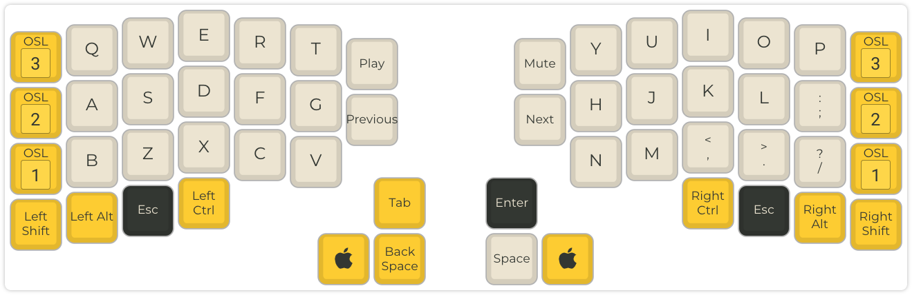
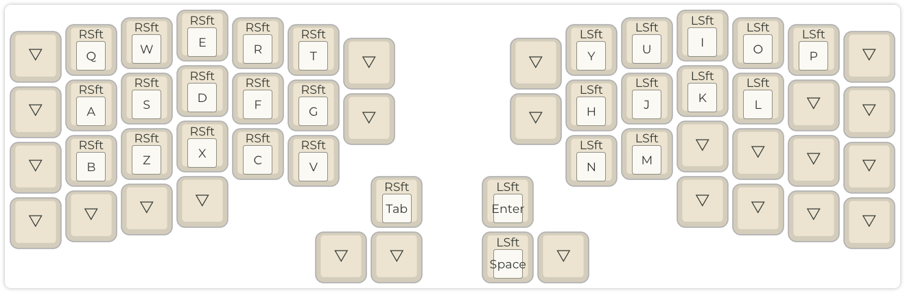
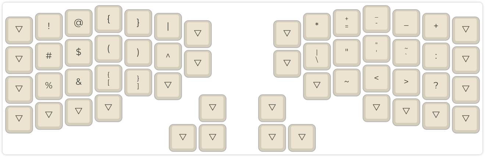
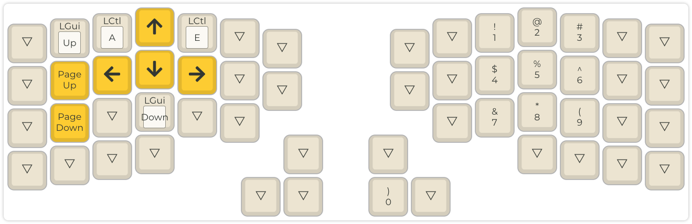

# ErgoA

An optimized layout for speed, recallability and ergonomics.


## Default

### Layers

Undefined keys use the corresponding one of the base layer.

Base
```txt
q w e r t   y u i o p
a s d f g   h j k l ;
b z x c v   n m , . /
```

Shift
```txt
Q W E R T   Y U I O P
A S D F G   H J K L
B Z X C V   N M
```

Symbols
```txt
! @ { } |   * = - _ +
# $ ( ) ^   \ " ' ` :
% & [ ]       ~ < > ?
```

### Development

Checkout the makefile on how to build the firmware.

Finally use Teensy Loader to load the firmware onto the ErgoDox EZ.

1. Drag and drop the `*.hex` file in the `.build-*` directory
  onto the Teensy app
1. Click reset button of ErgoDox EZ with long wire
1. Press `Auto` in right corner of Teensy to upload the firmware


## Travel

Reduced version for the
[ErgoTravel](https://github.com/jpconstantineau/ErgoTravel) keyboard
with 54 keys.


### Layers

#### Layer 0 - Base




#### Layer 1 - Shift




#### Layer 2 - Symbols




#### Layer 3 - Motion & Numbers




### Development

Use the [QMK Configurator](https://config.qmk.fm) for editing the
include [layout file](./ergoa_travel.json).


## Keeb.io Iris Rev. 1

Reduced version for the
[Iris CE](https://keeb.io/products/iris-ce-keyboard) keyboard
with 54 keys.

Use [Via](https://usevia.app/) for editing the
[layout file](./keebo_iris_ce_rev1.json).
